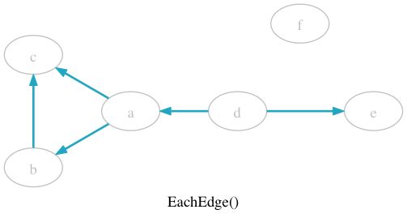
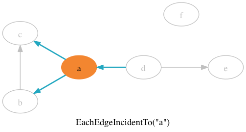
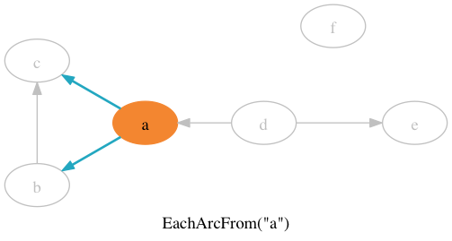

# gogl

[](https://travis-ci.org/sdboyer/gogl)
[](https://coveralls.io/r/sdboyer/gogl?branch=master)

gogl is a graph library in Go. Its goal is to provide simple, unifying interfaces and implementations of graph algorithms and datastructures that can scale from small graphs to very large graphs. The latter case is, as yet, untested!

gogl is based on the premise that working with graphs can be [decomplected](http://www.infoq.com/presentations/Simple-Made-Easy) by focusing primarily on the natural constraints established in graph theory.

There's still a lot to do - gogl is still firming up significant aspects of how its API works.

## Principles

Graph systems are often big, complicated affairs. gogl tries to be not that. These are the operant principles:

1. Simplicity: fully and correctly modeling graph theoretic concepts in idiomatic Go.
1. Performance: be as fast as design constraints and known-best algorithms allow.
1. Extensibility: expect others to run gogl's graph datastructures through their own algorithms, , and gogl's algorithms with their graph implementations.
1. Functional: orient towards transforms, functors, and streams; achieve other styles through layering.
1. Flexibility: Be unopinionated about vertices, and minimally opinionated about edges.
1. Correctness: Utilize [commonly accepted graph terminology](http://en.wikipedia.org/wiki/Glossary_of_graph_theory) where possible, and adhere to its meaning.

The first and last points are key - names in gogl are carefully chosen, with the hope that they can guide intuition when stricter rules (e.g., the type system) become ambiguous. The [godoc](https://godoc.org/github.com/sdboyer/gogl) generally takes care to detail these subtleties. But godoc is a reference, not a tutorial.

## Quickstart

Getting started with gogl is simple: create a graph object, add your data, and off you go.

```go
package main

import (
	"fmt"
	"github.com/sdboyer/gogl"
	"github.com/sdboyer/gogl/dfs"
)

func main() {
	// gogl uses a builder to specify the kind of graph you want.
	graph := gogl.G().
		// The graph should be mutable. Default is immutable.
		Mutable().
		// The graph should have directed edges (arcs). Default is undirected.
		Directed().
		// The graph's edges are plain - no labels, weights, etc. This is the default.
		Basic().
		// No loops or parallel edges. This is the default.
		SimpleGraph().
		// gogl.AdjacencyList picks and returns an adjacency list-based graph, based on the spec.
		Create(gogl.AdjacencyList).
		// The builder always returns a Graph; type assert to get access to add/remove methods.
		(gogl.MutableGraph)

	// Adds two basic edges. Of course, this adds the vertices, too.
	graph.AddEdges(gogl.NewEdge("foo", "bar"), gogl.NewEdge("bar", "baz"))

	// gogl's core iteration concept is built on injected functions (VertexStep or
	// EdgeStep). Here, a VertexStep is called once per vertex in the graph;
	// the return value determines whether traversal continues.
	graph.EachVertex(func(v gogl.Vertex) (terminate bool) {
		fmt.Println(v) // Probably "foo\nbar\nbaz", but ordering is not guaranteed.
		return // returns false, so iteration continues
	})

	// gogl refers to these sorts of iterating methods as enumerators. There are four
	// such methods on undirected graphs, and two more on directed graphs.

	// If you know you need the full result set, gogl provides functors to collect enumerations
	// into slices. This makes ranging easy.
	var vertices []gogl.Vertex = gogl.CollectVertices(graph)
	for _, v := range vertices {
		fmt.Println(v) // same as with EachVertex().
	}

	// The pattern is the same with edge enumeration. These two have the same output:
	graph.EachEdge(func(e gogl.Edge) (terminate bool) {
		fmt.Println(e) // Probably "{foo bar}\n{bar baz}". Again, ordering is not guaranteed.
		return
	})
	for _, e := range gogl.CollectEdges(graph) {
		fmt.Println(e)
	}

	// gogl's algorithms all rely on these enumerators to do their work. Here, we use
	// a depth-first topological sort algorithm to produce a slice of vertices.
	var tsl []gogl.Vertex
	tsl, err := dfs.Toposort(graph, "foo")
	if err == nil {
		fmt.Println(tsl) // [baz bar foo]
	}
}
```

## Enumerators

Enumerators are the primary means by which gogl graphs are expressed. As shown in the Quickstart section, they are methods on graph datastructures that receive a 'step' function, and call that function once per datum (Vertex or Edge) that is found as the method traverses the graph. There are four enumerators for gogl's undirected graphs, and two additional ones for directed graphs.

An important guarantee of enumerators not necessarily implied by the interface is that they call the step function *exactly* once for each relevant datum. Client code should never have to deduplicate data.

Given the following graph:


Which could be created as follows:
```go
func main() {
	graph := gogl.G().Mutable().Directed().Create(gogl.AdjacencyList)

	graph.AddEdges([]gogl.Edge{
		NewEdge("a", "b"),
		NewEdge("b", "c"),
		NewEdge("a", "c"),
		NewEdge("a", "c"),
		NewEdge("d", "a"),
		NewEdge("d", "e"),
	})

	// 'f' is a vertex isolate.
	graph.EnsureVertex("f")
}
```

Calling `EachVertex()` would result in six calls to the injected step function, one for each of the contained vertices (marked in blue). It's important to remember that gogl makes no guarantees as to the order of these calls.


Calling `EachEdge()` will call the injected step six times, once for each of the contained edges:



These are the simplest of the enumerators; all others take a vertex as a start point (marked in orange) and work outwards from there.

`EachAdjacentTo()` traverses "adjacent" vertices, which are defined as vertices adjoined together directly by a single edge. Edge directionality, if any, is irrelevant. In our sample graph, calling `EachAdjacentTo("a")` will result in three calls to the injected step:


The edge-iterating counterpart to `EachAdjacentTo()` is `EachEdgeIncidentTo()`. Any edge that has a vertex as one of its two endpoints is considered incident to that vertex. Edge directionality, if any, is irrelevant. Here's `EachEdgeIncidentTo("a")`:



The other two enumerators apply only to directed graphs, as they are sensitive to edge directionality. `EachArcFrom()` enumerates all the outbound edges/arcs from the given vertex:



And `EachArcTo()` enumerates all the edges/arcs inbound to the given vertex:


These six enumerators are gogl's most important building blocks. They fully describe the basic structure of a graph-based model, and can be combined to ask most any basic graph questions.

There are some additional enumerators for graph subtypes - e.g., `EachLabeledEdgeIncidentTo()` (not yet implemented) is an "optional optimization" enumerator that labeled graphs can implement if, say, they maintain indices that allow them to more efficiently locate and return the subset of incident edges with a particular label than would a naive traversal of the entire incident edge set with direct string comparisons.

Where possible, such optional optimizations are automatically selected and utilized by gogl's assorted functors.

## Functors, Counters, and bears, oh my!

@TODO

## Gotchas
